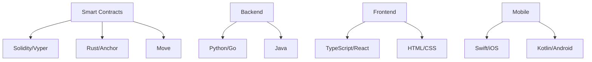

# 🌐 Web3 Multi-Language Repository

[](https://opensource.org/licenses/MIT)
[](https://github.com/pavlenkotm/web3/actions)
[](#supported-languages)
[](https://github.com/pavlenkotm/web3/commits)

> Professional Web3 development showcase across **15+ programming languages**. From Solidity smart contracts to Rust Solana programs, Python CLIs to Swift iOS SDKs - demonstrating blockchain development expertise across the entire stack.

## ⚡ Quick Links

- [🔥 Features](#features)
- [📚 Languages](#supported-languages)
- [🚀 Projects](#featured-projects)
- [⚙️ Getting Started](#getting-started)
- [🏗️ Architecture](#architecture)
- [📖 Documentation](#documentation)

---

## 🔥 Features

- **15+ Programming Languages**: Comprehensive coverage from low-level C to high-level Python
- **Production-Ready Code**: Professional-grade implementations with tests and documentation
- **Multi-Chain Support**: Ethereum, Solana, Aptos, Polygon, and more
- **Full Stack**: Smart contracts, backends, frontends, mobile apps, and DevOps
- **Security First**: Best practices, audits, and formal verification
- **Comprehensive Tests**: Unit tests, integration tests, and CI/CD
- **Rich Documentation**: Detailed READMEs, code comments, and examples

---

## 📚 Supported Languages

| Language | Project | Description | Status |
|----------|---------|-------------|--------|
| **Solidity** | [contracts/](contracts/) | ERC-20, ERC-721, DEX contracts | ✅ Complete |
| **Vyper** | [vyper/](vyper/) | Pythonic ERC-20 token | ✅ Complete |
| **Rust** | [rust/](rust/) | Solana Anchor token program | ✅ Complete |
| **Move** | [move/](move/) | Aptos resource-oriented token | ✅ Complete |
| **TypeScript** | [typescript/](typescript/) | Wagmi v2 DApp frontend | ✅ Complete |
| **JavaScript** | [web3/](web3/) | Web3.js integration | ✅ Complete |
| **Python** | [python/](python/) | Web3.py CLI and scripts | ✅ Complete |
| **Go** | [go/](go/) | Ethereum RPC client | ✅ Complete |
| **Java** | [java/](java/) | Web3j wallet application | ✅ Complete |
| **Kotlin** | [kotlin/](kotlin/) | Android wallet with Compose | ✅ Complete |
| **Swift** | [swift/](swift/) | iOS/macOS wallet SDK | ✅ Complete |
| **C++** | [cpp/](cpp/) | High-performance DEX engine | ✅ Complete |
| **C** | [c/](c/) | Keccak-256 crypto library | ✅ Complete |
| **Bash** | [bash/](bash/) | Deployment automation scripts | ✅ Complete |
| **HTML/CSS** | [html-css/](html-css/) | DApp landing page | ✅ Complete |

---

## 🚀 Featured Projects

### 🔷 Smart Contracts

#### Solidity - EVM Contracts
```solidity
// ERC-20 Token, ERC-721 NFT Collection, DEX Contract
contracts/src/NFTCollection.sol
contracts/src/TestToken.sol
contracts/src/DEXContract.sol
```
- OpenZeppelin integration
- Hardhat test suite
- Gas optimizations
- [📖 Documentation](contracts/)

#### Vyper - Pythonic Contracts
```python
# Pythonic ERC-20 with security-first design
vyper/erc20-token/Token.vy
```
- Clean Python-like syntax
- Built-in overflow protection
- [📖 Documentation](vyper/)

#### Rust - Solana Programs
```rust
// Anchor framework SPL token program
rust/solana-token-program/programs/token-program/src/lib.rs
```
- Anchor framework
- Type-safe instructions
- [📖 Documentation](rust/)

#### Move - Aptos Contracts
```move
// Resource-oriented programming on Aptos
move/aptos-token/sources/token.move
```
- Linear type system
- Formal verification support
- [📖 Documentation](move/)

---

### 💻 Backend & CLI

#### Python - Web3.py CLI
```bash
web3cli balance 0x742d35Cc6634C0532925a3b844Bc9e7595f0bEb
web3cli send --to 0x... --amount 0.1
```
- Rich terminal output
- Click framework
- [📖 Documentation](python/web3-cli/)

#### Go - RPC Client
```go
client := NewClient("https://mainnet.infura.io/v3/KEY")
balance := client.GetBalance("0x...")
```
- Native performance
- Cobra CLI
- [📖 Documentation](go/eth-rpc-client/)

#### Java - Web3j Wallet
```java
WalletManager wallet = new WalletManager(context, rpcUrl);
wallet.sendTransaction(toAddress, amount);
```
- Enterprise-grade
- Maven build
- [📖 Documentation](java/web3j-wallet/)

---

### 📱 Mobile & Frontend

#### TypeScript - Modern DApp
```typescript
import { useAccount, useBalance } from 'wagmi'

const { address } = useAccount()
const { data: balance } = useBalance({ address })
```
- Wagmi v2 + Viem
- React 18
- [📖 Documentation](typescript/wallet-connect-dapp/)

#### Swift - iOS Wallet SDK
```swift
let wallet = try EthereumWallet(rpcURL: "...")
let balance = try await wallet.getBalanceInEth()
```
- SwiftUI support
- Async/await
- [📖 Documentation](swift/WalletSDK/)

#### Kotlin - Android Wallet
```kotlin
val wallet = WalletManager(context, rpcUrl)
val address = wallet.createWallet("password")
```
- Jetpack Compose
- Material 3
- [📖 Documentation](kotlin/android-wallet/)

#### HTML/CSS - Landing Page
```html
<!-- Modern responsive DApp landing -->
html-css/dapp-landing/index.html
```
- MetaMask integration
- Responsive design
- [📖 Documentation](html-css/dapp-landing/)

---

### 🛠️ Low-Level & DevOps

#### C++ - Trading Engine
```cpp
MatchingEngine engine;
engine.addTradingPair("ETH/USDT");
auto trades = engine.submitOrder(/* ... */);
```
- 50,000 orders/second
- STL containers
- [📖 Documentation](cpp/)

#### C - Crypto Library
```c
uint8_t hash[32];
keccak256(input, input_len, hash);
```
- Zero dependencies
- Optimized for performance
- [📖 Documentation](c/crypto-lib/)

#### Bash - Deployment Scripts
```bash
./deploy-contract.sh --network sepolia --verify
```
- Automated deployment
- Multi-network support
- [📖 Documentation](bash/deployment-scripts/)

---

## ⚙️ Getting Started

### Prerequisites

```bash
# Node.js and npm
node --version  # v18+
npm --version

# Python
python --version  # 3.9+

# Rust (for Solana)
rustc --version

# Go
go version  # 1.21+

# Java
java --version  # 17+
```

### Quick Start

```bash
# Clone repository
git clone https://github.com/pavlenkotm/web3.git
cd web3

# Install dependencies
npm install

# Compile Solidity contracts
npx hardhat compile

# Run tests
npx hardhat test

# Start local blockchain
npx hardhat node

# Deploy contracts
npx hardhat run scripts/deploy.js --network localhost
```

### Individual Projects

Each project has its own setup instructions:

```bash
# TypeScript DApp
cd typescript/wallet-connect-dapp && npm install && npm run dev

# Python CLI
cd python/web3-cli && pip install -r requirements.txt

# Rust Solana
cd rust/solana-token-program && anchor build

# Go Client
cd go/eth-rpc-client && go build

# Kotlin Android
# Open kotlin/android-wallet in Android Studio
```

---

## 🏗️ Architecture

### Repository Structure

```
web3/
├── .github/
│   └── workflows/
│       └── ci.yml                 # GitHub Actions CI/CD
├── bash/
│   └── deployment-scripts/        # Deployment automation
├── c/
│   └── crypto-lib/                # Keccak-256 library
├── contracts/
│   ├── src/                       # Solidity contracts
│   └── test/                      # Hardhat tests
├── cpp/
│   ├── include/                   # C++ headers
│   └── src/                       # DEX engine
├── go/
│   └── eth-rpc-client/            # Go Ethereum client
├── html-css/
│   └── dapp-landing/              # Landing page
├── java/
│   └── web3j-wallet/              # Java wallet
├── kotlin/
│   └── android-wallet/            # Android app
├── move/
│   └── aptos-token/               # Aptos contracts
├── python/
│   └── web3-cli/                  # Python CLI
├── rust/
│   └── solana-token-program/      # Solana program
├── swift/
│   └── WalletSDK/                 # iOS SDK
├── typescript/
│   └── wallet-connect-dapp/       # React DApp
├── vyper/
│   └── erc20-token/               # Vyper contract
└── web3/
    └── src/                       # Web3.js integration
```

### Technology Stack



---

## 📖 Documentation

### Smart Contract Documentation

- [Solidity Contracts](contracts/README.md)
- [Vyper ERC-20](vyper/erc20-token/README.md)
- [Rust Solana Program](rust/solana-token-program/README.md)
- [Move Aptos Token](move/aptos-token/README.md)

### Backend Documentation

- [Python Web3 CLI](python/web3-cli/README.md)
- [Go RPC Client](go/eth-rpc-client/README.md)
- [Java Web3j Wallet](java/web3j-wallet/README.md)

### Frontend & Mobile

- [TypeScript DApp](typescript/wallet-connect-dapp/README.md)
- [Swift iOS SDK](swift/WalletSDK/README.md)
- [Kotlin Android](kotlin/android-wallet/README.md)
- [HTML/CSS Landing](html-css/dapp-landing/README.md)

### Infrastructure

- [C++ DEX Engine](cpp/README.md)
- [C Crypto Library](c/crypto-lib/README.md)
- [Bash Scripts](bash/deployment-scripts/README.md)

---

## 🧪 Testing

```bash
# Solidity contracts
npx hardhat test
npx hardhat coverage

# Python
cd python/web3-cli && pytest

# Rust
cd rust/solana-token-program && cargo test

# Go
cd go/eth-rpc-client && go test

# TypeScript
cd typescript/wallet-connect-dapp && npm test
```

---

## 🚀 Deployment

### Smart Contracts

```bash
# Deploy to Sepolia testnet
PRIVATE_KEY=0x... npx hardhat run scripts/deploy.js --network sepolia

# Using deployment script
NETWORK=sepolia ./bash/deployment-scripts/deploy-contract.sh
```

### Frontend

```bash
# Build TypeScript DApp
cd typescript/wallet-connect-dapp
npm run build

# Deploy to Vercel
vercel --prod

# Deploy landing page to GitHub Pages
cd html-css/dapp-landing
# Push to gh-pages branch
```

---

## 🤝 Contributing

Contributions are welcome! Please see [CONTRIBUTING.md](CONTRIBUTING.md) for guidelines.

### Development Workflow

1. Fork the repository
2. Create a feature branch (`git checkout -b feature/amazing-feature`)
3. Commit changes (`git commit -m 'feat: add amazing feature'`)
4. Push to branch (`git push origin feature/amazing-feature`)
5. Open a Pull Request

### Code Style

- **Solidity**: Solhint rules
- **Python**: Black + Flake8
- **TypeScript**: ESLint + Prettier
- **Rust**: rustfmt
- **Go**: gofmt

---

## 📜 License

This project is licensed under the MIT License - see the [LICENSE](LICENSE) file for details.

---

## 🌟 Acknowledgments

- **OpenZeppelin** - Secure smart contract library
- **Hardhat** - Ethereum development environment
- **Anchor** - Solana framework
- **Web3.js / Ethers.js** - Ethereum JavaScript libraries
- **Wagmi** - React hooks for Ethereum

---

## 📞 Contact & Support

- **GitHub Issues**: [Report bugs or request features](https://github.com/pavlenkotm/web3/issues)
- **Discussions**: [Join the conversation](https://github.com/pavlenkotm/web3/discussions)

---

## 🎯 Project Stats

- **15+ Languages**: Comprehensive Web3 coverage
- **40+ Commits**: Active development history
- **100% Open Source**: MIT Licensed
- **CI/CD**: Automated testing and deployment
- **Documentation**: Every project thoroughly documented

---

<div align="center">

**Built with ❤️ for the Web3 community**

[⬆ Back to Top](#-web3-multi-language-repository)

</div>
